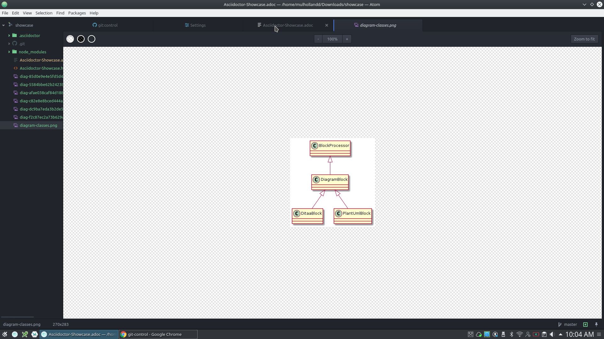

= Asciidoctor Showcase

== Where to find documentation

== A suggested installation

== Core functionality

== Math

== Extensions

=== Diagrams

Asciidoctor Diagram is a set of Asciidoctor extensions that enable you to add diagrams, which you describe using plain text, to your AsciiDoc document. The extensions support BlockDiag (BlockDiag, SeqDiag, ActDiag, NwDiag), Ditaa, GraphViz, Mermaid, PlantUML, Shaape and WaveDrom syntax.

gem install asciidoctor-diagram

sudo pip install actdiag blockdiag seqdiag nwdiag shaape

sudo apt install ditaa graphviz

sudo npm install -g mermaid --save-dev
sudo npm install phantomjs

Test

[actdiag]
....
actdiag {
  write -> convert -> image

  lane user {
     label = "User"
     write [label = "Writing reST"];
     image [label = "Get diagram IMAGE"];
  }
  lane actdiag {
     convert [label = "Convert reST to Image"];
  }
}
....

[blockdiag]
....
blockdiag admin {
  index [label = "List of FOOs"];
  add [label = "Add FOO"];
  add_confirm [label = "Add FOO (confirm)"];
  edit [label = "Edit FOO"];
  edit_confirm [label = "Edit FOO (confirm)"];
  show [label = "Show FOO"];
  delete_confirm [label = "Delete FOO (confirm)"];

  index -> add  -> add_confirm  -> index;
  index -> edit -> edit_confirm -> index;
  index -> show -> index;
  index -> delete_confirm -> index;
}
....

[seqdiag]
....
seqdiag {
  browser  -> webserver [label = "GET /index.html"];
  browser <-- webserver;
  browser  -> webserver [label = "POST /blog/comment"];
              webserver  -> database [label = "INSERT comment"];
              webserver <-- database;
  browser <-- webserver;
}
....

[nwdiag]
....
nwdiag {
  network dmz {
      address = "210.x.x.x/24"

      web01 [address = "210.x.x.1"];graphviz
      web02 [address = "210.x.x.2"];
  }
  network internal {
      address = "172.x.x.x/24";

      web01 [address = "172.x.x.1"];
      web02 [address = "172.x.x.2"];
      db01;
      db02;
  }
}
....

[ditaa]
....
                   +-------------+
                   | Asciidoctor |-------+
                   |   diagram   |       |
                   +-------------+       | PNG out
                       ^                 |
                       | ditaa in        |
                       |                 v
 +--------+   +--------+----+    /---------------\
 |        | --+ Asciidoctor +--> |               |
 |  Text  |   +-------------+    |   Beautiful   |
 |Document|   |   !magic!   |    |    Output     |
 |     {d}|   |             |    |               |
 +---+----+   +-------------+    \---------------/
     :                                   ^
     |          Lots of work             |
     +-----------------------------------+
....

[graphviz]
....
strict graph {
  a -- b
  a -- b
  b -- a [color=blue]
}
....

[plantuml, diagram-classes, png]
....
class BlockProcessor
class DiagramBlock
class DitaaBlock
class PlantUmlBlock

BlockProcessor <|-- DiagramBlock
DiagramBlock <|-- DitaaBlock
DiagramBlock <|-- PlantUmlBlock
....

[mermaid]
....
%% Example with slection of syntaxes
        gantt
        dateFormat  YYYY-MM-DD
        title Adding GANTT diagram functionality to mermaid

        section A section
        Completed task            :done,    des1, 2014-01-06,2014-01-08
        Active task               :active,  des2, 2014-01-09, 3d
        Future task               :         des3, after des2, 5d
        Future task2               :         des4, after des3, 5d

        section Critical tasks
        Completed task in the critical line :crit, done, 2014-01-06,24h
        Implement parser and jison          :crit, done, after des1, 2d
        Create tests for parser             :crit, active, 3d
        Future task in critical line        :crit, 5d
        Create tests for renderer           :2d
        Add to mermaid                      :1d

        section Documentation
        Describe gantt syntax               :active, a1, after des1, 3d
        Add gantt diagram to demo page      :after a1  , 20h
        Add another diagram to demo page    :doc1, after a1  , 48h

        section Last section
        Describe gantt syntax               :after doc1, 3d
        Add gantt diagram to demo page      : 20h
        Add another diagram to demo page    : 48h
....
